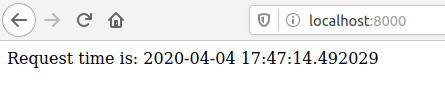
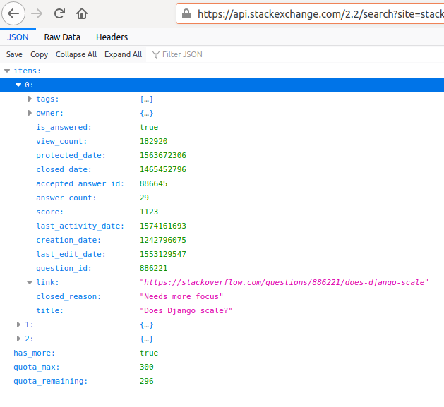
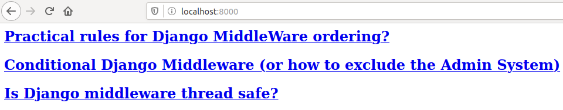

Django comes with a lot of useful features. One of them is middleware. In this
post I'll give a short explanation how middleware works and how to start writing
your own.

The source code included in this post is available on
[GitHub](https://github.com/pfertyk/getting-started-with-django-middleware).

## General concept

Middleware allows you to process requests from a browser before they reach a
Django view, as well as responses from views before they reach a browser.
Django keeps a list of middleware for each project. You can find it in settings,
under the name `MIDDLEWARE`. Each new Django project already has a bunch of
middleware added to that list, and in most cases you should not remove anything
from that list. You can, however, add your own.

Middleware is applied in the same order it is added to the list in Django settings.
When a browser sends a request, it is processed like this:

```bash
Browser -> M_1 -> M_2 -> ... -> M_N -> View
```

A view receives a request, performs some operations, and returns a response.
On its way to the browser, the response has to go through each middleware
again, but in reversed order:

```bash
Browser <- M_1 <- M_2 <- ... <- M_N <- View
```

This is a very brief explanation. More detailed description can be found in
[Django documentation](https://docs.djangoproject.com/en/3.0/topics/http/middleware/).

## A simple example

We will start with a simple middleware that measures the time it takes to
process a request. All examples in this post use Django 3.0.5 and Python 3.6.9.

### Project setup

First, create a Django project with a single application. Ignore the migrations,
examples from this post will not use a database. Create a file called
`middleware.py` in your application: that's where we will put most of the code.

```bash
django-admin startproject django_middleware
cd django_middleware
python manage.py startapp intro
touch intro/middleware.py
```

Your project should look like this:

```
django_middleware/
├── django_middleware
│   ├── asgi.py
│   ├── __init__.py
│   ├── settings.py
│   ├── urls.py
│   └── wsgi.py
├── intro
│   ├── admin.py
│   ├── apps.py
│   ├── __init__.py
│   ├── middleware.py
│   ├── migrations
│   │   └── __init__.py
│   ├── models.py
│   ├── tests.py
│   └── views.py
└── manage.py
```

Don't forget to register your application in `django_middleware/settings.py`:

```python
INSTALLED_APPS = [
    'intro',
    ...
]
```

Now you can run the project:

```bash
python manage.py runserver
```

### Writing Django middleware

According to [Django documentation](https://docs.djangoproject.com/en/3.0/topics/http/middleware/),
there are 2 ways of creating a middleware: as a function and as a class. We will
use the first method, but the last example will show you how to create a class too.

The general structure of a middleware in Django looks like this (example copied
from Django docs):

```python
def simple_middleware(get_response):
    # One-time configuration and initialization.
    def middleware(request):
        # Code to be executed for each request before
        # the view (and later middleware) are called.
        response = get_response(request)
        # Code to be executed for each request/response after
        # the view is called.
        return response
    return middleware
```

The `simple_middleware` function is called once, when Django initializes the middleware
and adds it to the list of all middleware used in a project.
The `middleware` function is called for every request made to the server. Everything
before the line `response = get_response(request)` is called when the request goes
from the browser to the server. Everything after this line is called when the
response goes from the server back to the browser.

What does the line `respone = get_response(request)` do? In short, it calls the
next middleware on the list. If this is the last middleware, the view gets called:
it receives the request, performs some operations, and generates the response.
That response is then returned to the last middleware on the list, which in turn
sends it to the previous one, until there is no more middleware and the response
is sent to the browser.

In our example, we want to check how long the whole process of handling a request
takes. Edit `intro/middleware.py` file like this:

```python
import time


def timing(get_response):
    def middleware(request):
        t1 = time.time()
        response = get_response(request)
        t2 = time.time()
        print("TOTAL TIME:", (t2 - t1))
        return response
    return middleware
```

In this example, we measure the time in seconds (`time.time()`) before and after
the request, and we print the difference.

The next step is to install the middleware, to let Django know that we are going
to use it. All we have to do is to add it to `django_middleware/settings.py`:

```python
MIDDLEWARE = [
    'intro.middleware.timing',
    ...
]
```

Note: in this example, `intro` is the name of our Django application, `middleware`
is the name of a Python file that contains our code, and `timing` is the name
of a middleware function in that file.

Now we are ready to test it. Open your browser and navigate to `localhost:8000`.
In the browser you should see the default Django project page (the one with the rocket).
In the command line (where you called `python manage.py runserver`) you should see something
similar to this:

```
TOTAL TIME: 0.0013387203216552734
[04/Apr/2020 17:15:34] "GET / HTTP/1.1" 200 16351
```

## Modifying the request

Our middleware does quite well, printing information to the command line. But
we can go a step further: how about adding something to the request, so that
our views can use it later? Since we are in the timing business, how about adding
the date and time the request took place?

This modification will be quite easy. Edit `intro/middleware.py` file like this:

```python
import time
import datetime


def timing(get_response):
    def middleware(request):
        request.current_time = datetime.datetime.now()
        t1 = time.time()
        response = get_response(request)
        t2 = time.time()
        print("TOTAL TIME:", (t2 - t1))
        return response
    return middleware
```

We've added 2 lines: `import datetime` and `request.current_time = datetime.datetime.now()`.
Together, they will add the current time to our request. Now, we need a view
to display that time. Edit `intro/views.py`:

```python
from django.http import HttpResponse


def showtime(request):
    return HttpResponse('Request time is: {}'.format(request.current_time))
```

For such a simple example we do not need a template, we can create
a HttpResponse object directly in our code.

Now we need a URL for our view. Create a file `intro/urls.py` and edit it:

```python
from django.urls import path
from .views import showtime

urlpatterns = [
    path('', showtime),
]
```

Remember to edit `django_middleware/urls.py` too:

```python
from django.contrib import admin
from django.urls import include, path

urlpatterns = [
    path('', include('intro.urls')),
    path('admin/', admin.site.urls),
]
```

Let's test it. Open `localhost:8000` in your browser. You should see something
like this:



Refresh the page several times, to check that you will get different results
(the time should be updated for each request).

## Something more useful: processing exceptions

It's time for a bit more interesting example. Consider this real-life situation:
you write a program and it doesn't work. Happens to the best of us, don't worry.
What do you usually do then? Do you check Stack Overflow for answers? You probably
do, practically all coders do. How about we create a middleware that would do
the search for us?

Django middleware can include a function that will be called each time an exception
is raised. That function is called `process_exception` and it takes 2 arguments:
a request that caused the exception and the exception itself.

If our middleware is defined as a function, than we can implement `process_exception`
like this:

```python
def simple_middleware(get_response):
    def middleware(request):
        return get_response(request)

    def process_exception(request, exception):
        # Do something useful with the exception
        pass

    middleware.process_exception = process_exception
    return middleware
```

In our case, we want to send our exception to Stack Overflow and get links to
the most relevant questions.

### Short introduction to APIs

If you haven't used APIs before, don't worry. The general idea is: just like you
send question to the internet using a web browser, API is a way for your code
to send questions automatically.

Stack Exchange is kind enough to host an API for querying their websites. The
base URL is `https://api.stackexchange.com/2.2/search`, after which you can put
search params. And so, if you want to check 3 top results (sorted by votes) from
Stack Overflow, tagged as "python" and dealing with Django, you can send a request
like this: `https://api.stackexchange.com/2.2/search?site=stackoverflow&pagesize=3&sort=votes&order=desc&tagged=python&intitle=django`. Go ahead and check it in your browser. You should see something like this:



In Python, to send a request like this, we will use a module called `requests`


### Stack Overflow middleware

Let's create a new middleware called `stackoverflow`:

```python
import requests
from django.http import HttpResponse

# Previous imports and timing middleware should remain unchanged


def stackoverflow(get_response):
    def middleware(request):
        # This method does nothing, all we want is exception processing
        return get_response(request)

    def process_exception(request, exception):
        url = 'https://api.stackexchange.com/2.2/search'
        params = {
            'site': 'stackoverflow',
            'order': 'desc',
            'sort': 'votes',
            'pagesize': 3,
            'tagged': 'python;django',
            'intitle': str(exception),
        }
        response = requests.get(url, params=params)
        html = ''
        for question in response.json()['items']:
            html += '<h2><a href="{link}">{title}</a></h2>'.format(**question)
        return HttpResponse(html)

    middleware.process_exception = process_exception

    return middleware
```

Every time a view raises an exception, our `process_exception` method will be
called. We use the `requests` module to call Stack Exchange API. Most parameters
are self-explanatory. They are the same as we used in the browser example, but
instead of putting them all in a URL manually, we let the `requests` module do
it for us. We just changed the tags (to search for Python and Django) and we
use our exception as a string (`str(exception)`)
to search the title of available questions. After we get a response from
Stack Overflow, we put together a HTML containing a link to each relevant
question. Hopefully, we can find an answer to our problem there. Finally, that
HTML is returned to the browser.

Please note that the response from Stack Overflow is not a normal web page, but
instead it is a bunch of information in a format called JSON. That's why we
call `response.json()` to get our results.

Of course, we need to install this new middleware:

```python
MIDDLEWARE = [
    'intro.middleware.stackoverflow',
    'intro.middleware.timing',
    ...
]
```

The only problem we have now is that our view works perfectly. We need to break
it a bit if we want our new middleware to have some exceptions to process.
Edit `intro/views.py`:

```python
def showtime(request):
    raise Exception('Django middleware')
    # return HttpResponse('Request time is: {}'.format(request.current_time))
```

Keep in mind that `process_exception` method will be called only for actual
exceptions. Returning HttpResponseServerError or any other error code does not
count.

It's time to test it. Open `localhost:8000` in your browser. You should see something
like this:



The middleware we just created is a bit more complicated than the initial examples.
As your code grows, it might be a better idea to manage middleware as classes,
not functions. Our Stack Overflow middleware as a class would look like this:

```python
class StackOverflow():
    def __init__(self, get_response):
        self.get_response = get_response

    def __call__(self, request):
        return self.get_response(request)

    def process_exception(self, request, exception):
        url = 'https://api.stackexchange.com/2.2/search'
        params = {
            'site': 'stackoverflow',
            'order': 'desc',
            'sort': 'votes',
            'pagesize': 3,
            'tagged': 'python;django',
            'intitle': str(exception),
        }
        response = requests.get(url, params=params)
        html = ''
        for question in response.json()['items']:
            html += '<h2><a href="{link}">{title}</a></h2>'.format(**question)
        return HttpResponse(html)
```

Most of the code looks similar, but for a class we need to store the `get_response`
callback in our instance and use it for every `__call__` method call. If you
prefer this version, don't forget to change the settings:

```python
MIDDLEWARE = [
    'intro.middleware.StackOverflow',
    ...
]
```

## Conclusion

These were very simple examples, but middleware can be used for many other things,
like checking an authorization token, finding a proper user, and attaching that
user to the request. I'm sure you can find a lot of ideas on your own, and hopefully
this post will help you get started. If you think something is missing or if you
spot a mistake, please let me know!
