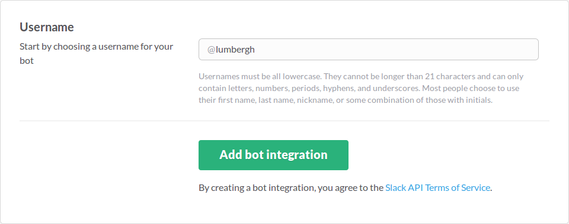
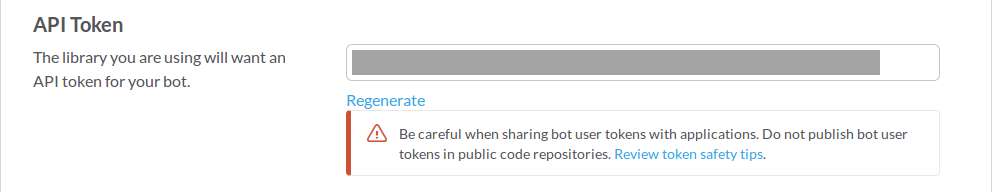
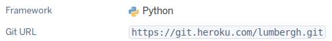
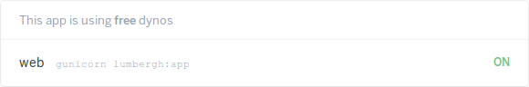
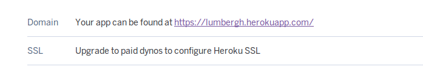
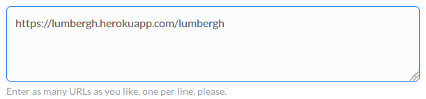

Recently I tried to create a Slack bot. It's job was to read messages and, if *'that would be great'* was detected in the content, respond to the message with a picture of Bill Lumbergh from *Office Space* (yeah, I'm a funny guy). But I found out that the learning resources are somewhat scattered around the Internet. It was difficult for a person not familiar with Slack API and with bots in general to quickly create nothing more than a simple bot. I finally put together the information from different sources and decided to describe the process here.

This post will show you how to integrate with Slack in two ways: using bot users and outgoing webhooks. You don't have to know anything about Slack or Python frameworks, but basic Python skills are required (also a Heroku account or your own server would be helpful). The code will be simple and will do the one and only task that I mentioned: detect the phrase and respond with an image. Let't get right to it!

## Bot users

Slack allows you to create [bot users](https://api.slack.com/bot-users). They are very similar to normal users, except they can be controlled using the API token.

### Create a bot user

To create a new bot user, visit [this link](https://my.slack.com/services/new/bot) (of course, you have to be a full member of your team to do that). First, you need to pick a name for your bot:



Then, you can access your bot's settings. It is possible (and advised!) to give it a nice name and a proper icon. But the important part here is the token:



This will be required for your Python code to post messages to Slack channels. From now on, I'm going to assume that your token is `xoxo-123token`.

Now that your bot is created, go ahead and invite it:


The bot should be more than happy to accept the invitation:


### Write the code

First, you need to create a new virtualenv and install `slackclient`:

```sh
mkvirtualenv -p /usr/bin/python3 slack-bot
pip install slackclient
```

Next you have to actually create a Slack client, using your bot's token. For security reasons set the environment variable with the token:

```sh
export SLACKBOT_LUMBERGH_TOKEN=xoxo-123token
```

and then use it in Python:

```python
from slackclient import SlackClient
import os


token = os.environ.get('SLACKBOT_LUMBERGH_TOKEN')
slack_client = SlackClient(token)
```

There are many methods provided by `slackclient` (you can check the [documentation](http://python-slackclient.readthedocs.io/en/latest/)). For this example, we are going to use just 3 of them.

To start working with Slack use `rtm_connect`. It will open a websocket connection and start to listen for events.

```python
if slack_client.rtm_connect():
    # proceed
else:
    print('Connection failed, invalid token?')
```

To get the list of events, use `rtm_read`. It will return a list of events since the last call.

```python
events = slack_client.rtm_read()
for event in events:
    # process event
```

There are different types of events. You want to intercept those that have a `message` type, come from a specific channel and contain some text:

```python
if (
    'channel' in event and
    'text' in event and
    event.get(type) == 'message'
):
    # this is the event you are looking for
```

Now that you have an actual message, you can check if the text contains the phrase *'that would be great'*. If so, you can post a new message to a Slack channel the message came from. To do this, use `api_call` method:

```python
link = '<https://cdn.meme.am/instances/400x/33568413.jpg|That would be great>'

slack_client.api_call(
    'chat.postMessage',
    channel=event['channel'],
    text=link,
    as_user='true:'
)
```

Some things might require an explaination:

* `'chat.postMessage'` defines that type of the API call you are going to make (in this case, you want to post a message)
* `as_user='true:'` will make your bot's messages appear as they were sent by a normal Slack user
* link's format is `<actual_url|Displayed text>`


You code by far should look like this:

```python
from slackclient import SlackClient
import time
import os

token = os.environ.get('SLACKBOT_LUMBERGH_TOKEN')

slack_client = SlackClient(token)

link = '<https://cdn.meme.am/instances/400x/33568413.jpg|That would be great>'

if slack_client.rtm_connect():
    while True:
        events = slack_client.rtm_read()
        for event in events:
            if (
                'channel' in event and
                'text' in event and
                event.get('type') == 'message'
            ):
                channel = event['channel']
                text = event['text']
                if 'that would be great' in text.lower() and link not in text:
                    slack_client.api_call(
                        'chat.postMessage',
                        channel=channel,
                        text=link,
                        as_user='true:'
                    )
        time.sleep(1)
else:
    print('Connection failed, invalid token?')
```

The `sleep(1)` fragment was added to slow down the loop a bit. Notice that the text is also checked for the presence of the link itself (otherwise your bot would start answering its own messages).

Assuming that you named your file `main.py` you can now run the program:

```sh
python main.py
```

and see your bot in action:


It works quite nicely, except for that awful endless loop. That is not how the code should look like. If only there was a way to react to actual messages instead of reading all the events...

## Outgoing webhooks

Fortunately, Slack provides another way of integrating with other services: webhooks. Thanks to them you can receive a call each time a message is sent to a channel.

### Create a webhook

Go to [Outgoing WebHooks](https://my.slack.com/services/new/outgoing-webhook) page and click **Add Outgoing WebHooks integration**. You will be redirected to the **Edit configuration** page, and you will immediately notice some limitations:

* the integration can only be enabled for one specific channel or for all messages starting with specific (trigger) words
* you will need a server with a public IP address to send the messages to (you need to provide a URL that Slack can find)
* you can still customize the name and the icon, but you will have to repeat the process for each channel (unless you are going to use trigger words)

So, is it even worth the effort to use this outgoing webhook instead of a bot user? I think it is. Infinite loops without breaking conditions are evil and you should avoid them. Besides, the downsides are not really that troublesome (you probably will use this integration on one or two channels anyway, and setting up the server with Heroku is quite easy).

Let's proceed with the configuration. Select the channel and leave the **Trigger Word(s)** section empty (you don't want to restrict the messages that will be answered). I'm going to assume for a moment that you have your own public IP address and that it is `123.1.2.3` (don't worry, in just a moment you will deploy your program to Heroku and that will take care of the public IP problem). Put `123.1.2.3/lumbergh` in the **URL(s)** field. You can also customize the name and the icon.

There is another important section here: **Token**. It contains the token that will be added to each API call send to the URLs you provided. You will get back to it in a moment.

Click **Save Settings** button. Notice that you don't need to invite an integration to a channel, it will be added automatically when you create the webhook (also, unlike bot users, integrations can have names starting with a capital letter):


### Write the code

The new version of your program will not require `slackclient` at all. Instead, you are going to use `flask`:


```sh
pip install flask
```

A very simple application would look like this:

```python
from flask import Flask

app = Flask(__name__)

if __name__ == '__main__':
    app.run(host='0.0.0.0')  # make the app externally visible
```

This of course will not do anything useful, so let's create an endpoint:

```python
@app.route('/lumbergh', methods=['POST'])
def lumbergh():
    text = request.form.get('text', '')
    if 'that would be great' in text.lower() and link not in text:
        return jsonify(text=link)
    return Response(), 200
```

Now every time Slack calls `123.1.2.3/lumbergh`, the program will check if the message contains the phrase *'it would be great'*. If so, a link to the image will be returned. Notice that you no longer need to use `api_call` here: the response with a text will be automatically converted to a new message by Slack.

The code of your program should look like this:


```python
from flask import Flask, request, Response, jsonify

app = Flask(__name__)
link = '<https://cdn.meme.am/instances/400x/33568413.jpg|That would be great>'


@app.route('/lumbergh', methods=['POST'])
def lumbergh():
    text = request.form.get('text', '')
    if 'that would be great' in text.lower() and link not in text:
        return jsonify(text=link)
    return Response(), 200

if __name__ == '__main__':
    app.run(host='0.0.0.0')
```

Do you remember the token that Slack created for your outgoing webhook? You might notice that there is no token validation here. If you want, you can check if the call was made by Slack:

```python
def lumbergh():
    if request.form.get('token') == os.environ.get('WEBHOOK_TOKEN'):
        # process the message
    return Response(), 200
```

I decided however to skip the validation. That way one instance of a program can be used with multiple channels.

You can run the your new app (on a publicly available server):

```sh
python main.py
```

and check if it works:


The problem is that you still need to have a public IP address. Let's solve this problem with Heroku.

### Deploying on Heroku

I'm going to assume that you already have a Heroku account and that you installed **Heroku CLI**. Create a new app and give it a nice name (I picked *lumbergh*). Go to **Settings**, check the git URL and configure the git remote accordingly:



```sh
git init
git remote add heroku https://git.heroku.com/lumbergh.git
```

To run the program you will need a server, for example `gunicorn`:

```sh
pip install gunicorn
```

For a program to work with Heroku, you have to create an additional file called `Procfile`:

```ini
web: gunicorn lumbergh:app
```

Also, since [Python 2.x is legacy and Python 3.x is the present and future of the language](https://wiki.python.org/moin/Python2orPython3), you should inform Heroku that you want to use the proper version of Python by creating a `runtime.txt` file:

```ini
python-3.4.3
```

Now you can deploy to Heroku (remember that first you need to use `heroku login`):

```sh
git push heroku master
```

Check the **Overview** to see if the program is working:



Now you can change the URL for the Slack webhook to the one provided by Heroku (you will find it in **Settings**):




## Summary

As it turns out, answering messages automatically on Slack is very easy. Bot users can be enabled for many channels, but they need an infinite loop to process events. Outgoing webhooks can be called for each message, but they need a public IP and have to be added to each channel separately. And both of these solutions can be implemented in less than 31 lines of code.

The source code for this Slack bot can be found [here](https://github.com/pfertyk/lumbergh-slackbot). The latest version contains the webhook integration, but the first commit shows the bot user program. If you don't have the time to configure the bot by yourself, you can use my Heroku instance (just add a new outgoing webhook with `https://lumbergh.herokuapp.com/lumbergh` URL).

If you find any problems with this tutorial, please let me know.
