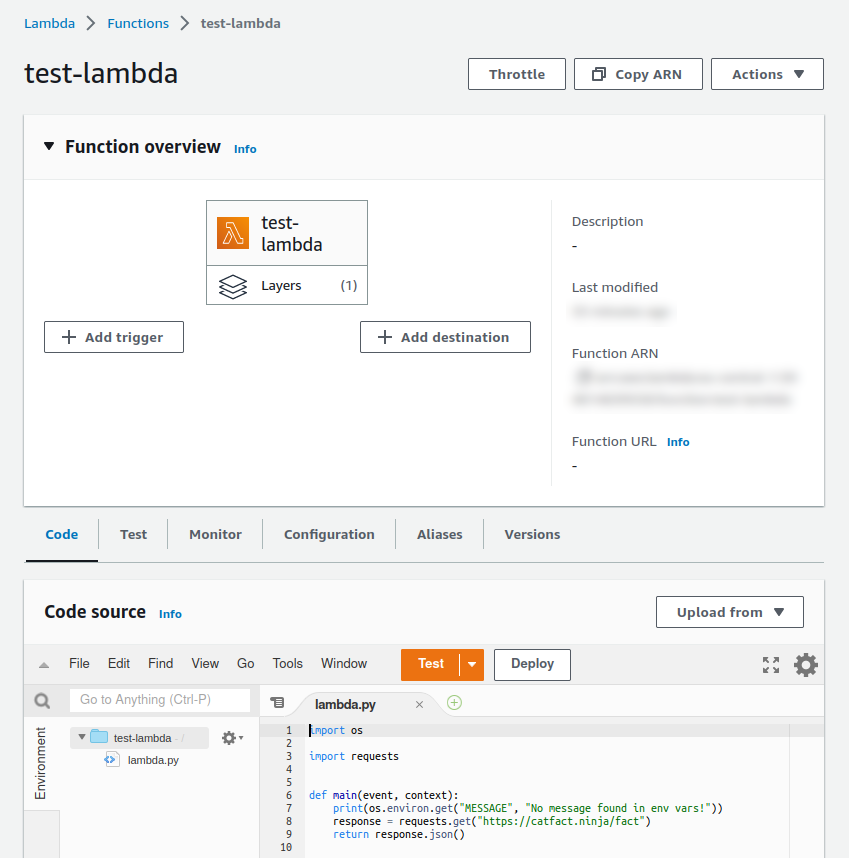
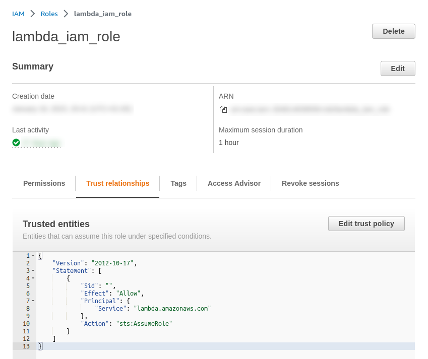

This post shows how to create an AWS Lambda function using Terraform. It is not meant as a thorough explanation of the topic, but rather a template that you can easily adjust to your own needs.

The language of choice is Python, but with some minor modifications this configuration will work for other languages as well.

The full source code for this article is available in [this repository](https://github.com/pfertyk/terraform-templates).

## Terraform setup

Let's start with some boilerplate Terraform configuration. Create a file called `config.tf`:

```tf
terraform {
  required_version = "= 1.2.7"
}

provider "aws" {
  region = "eu-central-1"
}
```

Feel free to select any region that is geographically close to you.

This template relies on AWS as a provider. Creating an AWS account and generating Terraform credentials is outside the scope of this article, but you can relate to other resources (e.g. [Terraform documentation](https://registry.terraform.io/providers/hashicorp/aws/latest/docs)).

## Python dependencies

This step can theoretically be skipped, if you indent to use only core Python modules. However, it is more likely that you will want to install some dependencies and extend your code by their functionality. In order to provide such dependencies to your function, Lambda uses a mechanism called layers. This section will show you how to create a layer for your Python code.

### Installing modules locally

For simplicity, this template relies on a single dependency: [Requests](https://docs.python-requests.org/en/latest/index.html). Create a file called `requirements.txt` and insert a single line there:

```
requests==2.28.2
```

There are many sophisticated package managers for Python (e.g. [Pipenv](https://pipenv.pypa.io/en/latest/index.html)), but, again for simplicity, this template uses Pip. Create a file called `main.tf` and add the first Terraform resource:

```tf
resource "null_resource" "pip_install" {
  triggers = {
    shell_hash = "${sha256(file("${path.module}/requirements.txt"))}"
  }

  provisioner "local-exec" {
    command = "python3 -m pip install -r requirements.txt -t ${path.module}/layer"
  }
}
```

The command `python3 -m pip install -r requirements.txt -t ${path.module}/layer` will install Python dependencies into a local folder called `layer`. Providing a trigger based on a hash means that the command will run again every time there is a change in `requirements.txt`.

Please note that the command will be executed locally on your machine. That means that both Python3 and Pip have to be installed.

### Creating a .zip with dependencies

In order to upload a layer to AWS, it has to be turned into an archive first. Add the following resource to `main.tf`:

```tf
data "archive_file" "layer" {
  type        = "zip"
  source_dir  = "${path.module}/layer"
  output_path = "${path.module}/layer.zip"
  depends_on  = [null_resource.pip_install]
}
```

This configuration will turn the entire `layer` folder into `layer.zip` file. The process should happen every time there is a change in `requirements.txt`, but there is no direct dependency between this resource and `null_resource.pip_install`. To fix that, you can make the dependency explicit using `depends_on`.

### Configuring a layer resource

The last step in layer creation is configuring the layer resource itself. Add this to `main.tf`:

```tf
resource "aws_lambda_layer_version" "layer" {
  layer_name          = "test-layer"
  filename            = data.archive_file.layer.output_path
  source_code_hash    = data.archive_file.layer.output_base64sha256
  compatible_runtimes = ["python3.9", "python3.8", "python3.7", "python3.6"]
}
```

You can use any `layer_name` that you want. Providing `source_code_hash` means that the resource will be updated every time that the contents of the source file changes.

Additionally, `aws_lambda_layer_version` has to be provided with a list of compatible runtimes. In this template, different Python versions are configured. If you plan to use a different language, check the [available runtimes](https://docs.aws.amazon.com/lambda/latest/dg/lambda-runtimes.html) in AWS documentation.

## Python code

Now that the dependencies are provided, it's time to create an actual function. Similar to layer configuration, this process also involves several resources.

### Creating a Python file

Create a directory called `code` and, inside of it, create a single file called `lambda.py`:

```python
import os

import requests


def main(event, context):
    print(os.environ.get("MESSAGE", "No message found in env vars!"))
    response = requests.get("https://catfact.ninja/fact")
    return response.json()
```

The only function in this file, `main()`, will later be configured to run on Lambda execution. AWS requires a signature with 2 arguments: an event and a context. While this article doesn't elaborate on the meaning of those arguments, it demonstrates several other aspects of working with an AWS Lambda:

* reading environment variables (in this case: `MESSAGE`)
* using dependencies from a provided layer (in this case: to call an external API)
* returning a value from a Lambda (in this case: a random cat fact)

### Creating a .zip with the code

Similar to Lambda layer, the code also needs to be transformed into an archive. Add this resource to `main.tf`:

```tf
data "archive_file" "code" {
  type        = "zip"
  source_dir  = "${path.module}/code"
  output_path = "${path.module}/code.zip"
}
```

This time there is no need to add `depends_on`, as the resource will automatically check the contents of the `code` folder.

### Creating an IAM role

Unlike the layer resource, a Lambda requires an IAM role. Add this code to `main.tf`:

```tf
resource "aws_iam_role" "iam_role" {
  name = "lambda-iam-role"

  assume_role_policy = <<EOF
{
 "Version": "2012-10-17",
 "Statement": [
   {
     "Action": "sts:AssumeRole",
     "Principal": {
       "Service": "lambda.amazonaws.com"
     },
     "Effect": "Allow",
     "Sid": ""
   }
 ]
}
EOF
}
```

Feel free to change the name and to adjust the role's policy to suit your needs.

### Creating a Lambda resource

The last step is creating the Lambda resource itself. Add this to `main.tf`:

```tf
resource "aws_lambda_function" "lambda" {
  function_name    = "test-lambda"
  handler          = "lambda.main"
  runtime          = "python3.9"
  filename         = data.archive_file.code.output_path
  source_code_hash = data.archive_file.code.output_base64sha256
  role             = aws_iam_role.iam_role.arn
  layers           = [aws_lambda_layer_version.layer.arn]
  environment {
    variables = {
      "MESSAGE" = "Terraform sends its regards"
    }
  }
}
```

The `handler` specifies which method will be called when the Lambda is executed. In this template, it's `main()` from the file `lambda.py`. Runtime is set to `python3.9`, which corresponds to one of the compatible runtimes of the layer resource.

Specifying `filename` is required, unless you want to use an S3 bucket or an ECR image (those options are not covered in this article). In addition, the template uses `source_code_hash`, which will update the resource every time the contents of `code.zip` is changed.

Arguments `role` and `layers` are set to use the resources created earlier in this tutorial.

Finally, `environment` allows you to configure environment variables. For simplicity, this template uses only a single variable called `MESSAGE`.


## Applying the changes

At this point, your project should have the following structure:

```tree
├── code
│   └── lambda.py
├── layer
│   └── (Python dependencies)
├── config.tf
├── main.tf
└── requirements.txt
```

Please note that .zip files will be created after Terraform creates a plan.

To initialize Terraform and create AWS resources, use the following commands:

```
terraform init
terraform plan
```

The output from the second command should end with:

```
Plan: 4 to add, 0 to change, 0 to destroy.
```

If the output looks good, run this command and confirm with **"yes"**:

```
terraform apply
```

After Terraform is done, you should see your newly created Lambda in AWS console:



To test your Lambda, you need to create a test event first. Click the **Test** button and select any name (e.g. `test`). You can ignore the **Event JSON** field (your Lambda doesn't use the provided event). Click **Save** and then **Test** again, to execute the test event. Your output should be similar to this:

```
Test Event Name
test

Response
{
  "fact": "Cats lived with soldiers in trenches, where they killed mice during World War I.",
  "length": 80
}

Function Logs
START RequestId: e39ca580-a0e4-4541-91c9-48c9361a4dab Version: $LATEST
Terraform sends its regards
END RequestId: e39ca580-a0e4-4541-91c9-48c9361a4dab
REPORT RequestId: e39ca580-a0e4-4541-91c9-48c9361a4dab	Duration: 349.95 ms	Billed Duration: 350 ms	Memory Size: 128 MB	Max Memory Used: 50 MB

Request ID
e39ca580-a0e4-4541-91c9-48c9361a4dab
```

As you can see, the output contains both the environment variable that your function prints, and the return value of the function.

An IAM role will also be created and available in IAM Management Console:



This role can be reused for other functions.

## Cleanup

There is a very generous free tier for AWS Lambda. However, it's a good practice to remove the resources you no longer need, in order to avoid extra costs. When you're done with testing, use this command and confirm with **"yes"**:

```
terraform destroy
```

## Summary

This article describes a basic Terraform configuration for an AWS Lambda. While in the current version it has to be executed manually, it is a good starting point for many other projects, like periodic tasks (with EventBridge trigger), APIs (connected to API Gateway) or bots. I plan to cover some of them in the upcoming posts.

I hope that this tutorial helped you a bit. If you have any questions, or spot any mistakes, please don't hesitate to reach out!
