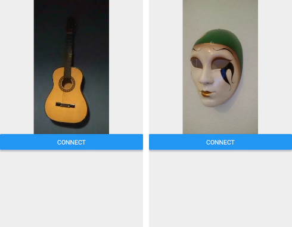

In one of my [previous posts]( "WebRTC: a working example")
I described how to set up WebRTC in a simple web application, without
unnecessary dependencies. Here I will expand that solution, making WebRTC
work on a mobile device.

For mobile development we will use [React Native](https://reactnative.dev/)
and [react-native-webrtc module](https://github.com/react-native-webrtc/react-native-webrtc).
The app was tested only on Android (versions 5.1 and 9), but after adding
proper configuration it should work also on iOS.

The source code and setup instructions for the mobile app are available on
[GitHub](https://github.com/pfertyk/webrtc-working-example).
In this post I will explain, step by step, how to build the app on your own.

## Differences between a browser and a mobile device

Using React Native for mobile development allows us to build an Android application
with JavaScript. Because of that, the source code will be very similar to
the original application (which was intended for web browsers). However,
there are some differences you should know about:

* **WebRTC for React Native doesn't need a secure context**. In Firefox, we had
to enable insecure media settings or use only `localhost`, otherwise we would
not get access to the `navigator` object. React Native works fine with any URL.
* **We can specify a camera**. Most mobile devices have 2 cameras (front and back),
so we can choose which one we want to use for our video stream.
* **Streams are rendered using `RTCView`**. In a web application, we used a normal
`video` element to show our stream on a web page. For React Native, that would
not work, and we need a dedicated element from the `react-native-webrtc` module.
* **All WebRTC related classes are provided by `react-native-webrtc`**. In the
web application, we could freely use objects like `navigator` or classes like
`RTCPeerConnection`. Now we will have to import them from the `react-native-webrtc`
module. Luckily, they look and work almost exactly the same.

## Creating a React Native app

Before working with React Native you need to setup the environment. Follow
[these instructions](https://reactnative.dev/docs/environment-setup) from the
official docs. In my experience, Watchman is not necessary, so you can skip that
step.

Also, as far as I know, WebRTC will not work with Expo and with emulators, so
follow the instructions for React Native CLI Quickstart.

To create a new mobile application called WebRTC, run:

```bash
npx react-native init WebRTC
cd WebRTC
npm install
npx react-native start
```

This will start a development server which reloads your app every time you change
the source code. To upload the app to your phone, connect the device via USB,
enable USB debugging, and run this command:

```bash
npx react-native run-android
```

When the command is done, you should see the default React Native application
on your phone. We are going to alter it a bit.

## Setting up WebRTC dependencies

To use WebRTC with React Native, we need to install `react-native-webrtc` module.
You might remember from the previous post that WebRTC also needs a signaling server,
so we will install `socket.io-client` for websocket communication:

```bash
npm install --save react-native-webrtc
npm install --save socket.io-client@2.1.1
```

We will use an older verson of `socket.io-client`, because the newest one
doesn't work very well with React Native, as you can read about in
[this GitHub issue](https://github.com/socketio/socket.io-client/issues/1290).
Also, our original Python signaling server with default settings will cause
a lot of warnings about long timers, so we should specify the ping timeout in `signaling/server.py`:

```python
sio = socketio.AsyncServer(cors_allowed_origins='*', ping_timeout=35)
```

The rest of the changes follow the [Android installation instructions](
https://github.com/react-native-webrtc/react-native-webrtc/blob/master/Documentation/AndroidInstallation.md
) for `react-native-webrtc` module, but we are going to go through them
step by step, applying only the changes that are really necessary.

First, we need to update our application's permissions by editing
`android/app/src/main/AndroidManifest.xml`:

```xml
<uses-permission android:name="android.permission.CAMERA" />
<uses-permission android:name="android.permission.RECORD_AUDIO" />
<uses-permission android:name="android.permission.ACCESS_NETWORK_STATE" />
```

We are going to use an older version of `gradle`, so we have to change
`android/build.gradle`:

```
classpath("com.android.tools.build:gradle:3.4.2")
```

We should also update `android/gradle/wrapper/gradle-wrapper.properties`:

```
distributionUrl=https\://services.gradle.org/distributions/gradle-5.5-all.zip
```

In `android/settings.gradle`, replace the line `include ':app'` with:

```
include ':WebRTCModule', ':app'
project(':WebRTCModule').projectDir = new File(rootProject.projectDir, '../node_modules/react-native-webrtc/android')
```

The last change is to add one line to `dependencies` in `android/app/build.gradle`:

```
dependencies {
  ...
  compile project(':WebRTCModule')
}
```

Unrelated to WebRTC, it would be more elegant to keep our source code in
a separate directory, so create a `src` directory, move our `App.js` file there,
and change `import App from './App';` to `import App from './src/App';` in `index.js`.

## Implementing WebRTC connection in React Native

We will keep our WebRTC code separately, in a file called `src/webrtc-utils.js`.
Let's start with importing the dependencies:

```javascript
import {
  RTCPeerConnection,
  RTCIceCandidate,
  RTCSessionDescription,
  mediaDevices,
} from 'react-native-webrtc';

import socketIO from 'socket.io-client';
```

All WebRTC classes are now provided by `react-native-webrtc` module, and we can
use `mediaDevices` without the `navigator` object, but other
than that, there are very few differences in comparison with a web browser.

Next, we will include configuration variables:

```javascript
// Config variables: change them to point to your own servers
const SIGNALING_SERVER_URL = 'http://192.168.0.1:9999';
const TURN_SERVER_URL = '192.168.0.1:3478';
const TURN_SERVER_USERNAME = 'username';
const TURN_SERVER_CREDENTIAL = 'credential';
// WebRTC config: you don't have to change this for the example to work
// If you are testing in local network, you can just use PC_CONFIG = {iceServers: []}
const PC_CONFIG = {
  iceServers: [
    {
      urls: 'turn:' + TURN_SERVER_URL + '?transport=tcp',
      username: TURN_SERVER_USERNAME,
      credential: TURN_SERVER_CREDENTIAL
    },
    {
      urls: 'turn:' + TURN_SERVER_URL + '?transport=udp',
      username: TURN_SERVER_USERNAME,
      credential: TURN_SERVER_CREDENTIAL
    }
  ]
};
```

They look almost the same as in the web version. The main difference is that
`iceServers` key has to be present in `PC_CONFIG`, even if we are not going to use
any ICE servers. In that case, you can just provide an empty array.

Keep in mind that you will probably run the signaling server on your computer,
not on your phone, so using `localhost` will not work. You will have to find your
computer's local IP address and replace the one in the configuration.

The last part of the file is a single class that encapsulates our WebRTC connection
logic. It is very similar to the code from the web version, and therefore will
not be explained here (you can check the detailed explanation in the previous
blog post). There are some minor differences:

* `react-native-webrtc` implementation does not provide a default argument for
`createOffer`, so we are going to call it with an empty object like this:
`createOffer({})` (`createAnswer` provides a default argument, so we don't have to)
* our `socketIO` will receive a bit more configuration, to specify the `websocket` protocol
* we will use a callback called `onRemoteStreamObtained` to make the remote
stream available for rendering
* instead of starting the connection immediately when the app loads, we will do
it when the `connect` method is called
* we will choose the front camera for our video stream: `video: {facingMode: 'user'}`

Other than that, the code is almost exactly the same as in the web version:

```javascript
export default class WebRTC {
  socket;
  pc;
  localStream;

  constructor() {
    this.socket = socketIO(SIGNALING_SERVER_URL, {
      autoConnect: false,
      jsonp: false,
      transports: ['websocket'],
    });
    // Signaling callbacks
    this.socket.on('data', this.onData);
    this.socket.on('ready', this.onReady);
  }

  connect = () => {
    this.getLocalStream();
  }

  // Signaling methods
  onData = (data) => {
    console.log('Data received: ', data);
    this.handleSignalingData(data);
  }

  onReady = () => {
    console.log('Ready');
    // Connection with signaling server is ready, and so is local stream
    this.createPeerConnection();
    this.sendOffer();
  }

  sendData = (data) => {
    this.socket.emit('data', data);
  };

  // WebRTC methods
  getLocalStream = () => {
    mediaDevices.getUserMedia({
      audio: true, video: {facingMode: 'user'},
    }).then((stream) => {
      console.log('Stream found');
      this.localStream = stream;
      // Connect after making sure that local stream is availble
      this.socket.connect();
    }).catch(error => {
      console.error('Stream not found: ', error);
    });
  }

  createPeerConnection = () => {
    try {
      this.pc = new RTCPeerConnection(PC_CONFIG);
      this.pc.onicecandidate = this.onIceCandidate;
      this.pc.onaddstream = this.onAddStream;
      this.pc.addStream(this.localStream);
      console.log('PeerConnection created');
    } catch (error) {
      console.error('PeerConnection failed: ', error);
    }
  };

  sendOffer = () => {
    console.log('Send offer');
    this.pc.createOffer({}).then(
      this.setAndSendLocalDescription,
      (error) => { console.error('Send offer failed: ', error); }
    );
  };

  sendAnswer = () => {
    console.log('Send answer');
    this.pc.createAnswer().then(
      this.setAndSendLocalDescription,
      (error) => { console.error('Send answer failed: ', error); }
    );
  };

  setAndSendLocalDescription = (sessionDescription) => {
    this.pc.setLocalDescription(sessionDescription);
    console.log('Local description set');
    this.sendData(sessionDescription);
  };

  onIceCandidate = (event) => {
    if (event.candidate) {
      console.log('ICE candidate');
      this.sendData({
        type: 'candidate',
        candidate: event.candidate
      });
    }
  };

  onAddStream = (event) => {
    console.log('Add stream');
    this.onRemoteStreamObtained(event.stream);
  };

  handleSignalingData = (data) => {
    switch (data.type) {
      case 'offer':
        this.createPeerConnection();
        this.pc.setRemoteDescription(new RTCSessionDescription(data));
        this.sendAnswer();
        break;
      case 'answer':
        this.pc.setRemoteDescription(new RTCSessionDescription(data));
        break;
      case 'candidate':
        this.pc.addIceCandidate(new RTCIceCandidate(data.candidate));
        break;
    }
  };
};
```

## Creating a React Native WebRTC component

The source code of the app itself (`src/App.js`) is very short:

```javascript
import React from 'react';
import { Button } from 'react-native';
import { RTCView } from 'react-native-webrtc';
import WebRTC from './webrtc-utils';

export default class WebRTCMobile extends React.Component {
  state = {
    remoteStreamURL: null,
  }

  onConnect = () => {
    this.webrtc = new WebRTC();
    this.webrtc.onRemoteStreamObtained = (stream) => {
      this.setState({remoteStreamURL: stream.toURL()});
    }
    this.webrtc.connect();
  }

  render() {
    return (
      <>
        <RTCView
          streamURL={this.state.remoteStreamURL}
          style={{width: 300, height: 300, alignSelf: 'center'}} />
        <Button onPress={this.onConnect} title='Connect' />
      </>
    );
  }
};
```

Even if you had no previous experience with React Native, it should not be
difficult to understand the general idea of this component. First, it imports the
required dependencies (including our WebRTC utils). Then, it displays the remote video
stream and a single button labelled "Connect". When the button is pressed,
we create an actual WebRTC connection.

As mentioned before, in React Native we have to use `RTCView` instead of a
`video` element. It is also important to use the state of our component to
store the remote stream URL. That way, when it becomes available, React Native
will automatically update the `RTCView`.

## Running the app

You can now test this application on your phone. Run `npx react-native run-android`
and see if the layout was updated. When 2 users press the "Connect" button,
video and audio streams from each of the applications should be sent to the other
one.



If you notice logs starting with "WebRTC tries to override ..." while building the
app, the easiest way to fix the problem is to remove `android/app/build`
directory and try again.

This app was also tested on a public network, with the same TURN server setup
as in the previous post.

## Conclusion

Using voice and audio communication over the Internet is a very useful feature.
It is especially useful for mobile devices, where it can partially
replace normal GSM calls. I hope this tutorial will help you get familiar with
this technology and start working on your own ideas. If you spot any mistakes
or missing pieces, please let me know!
